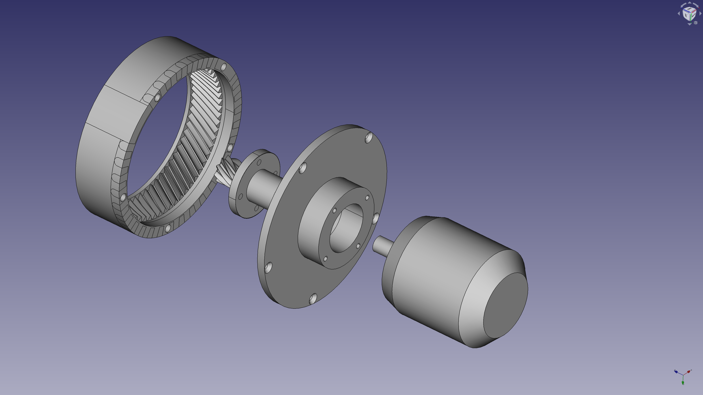
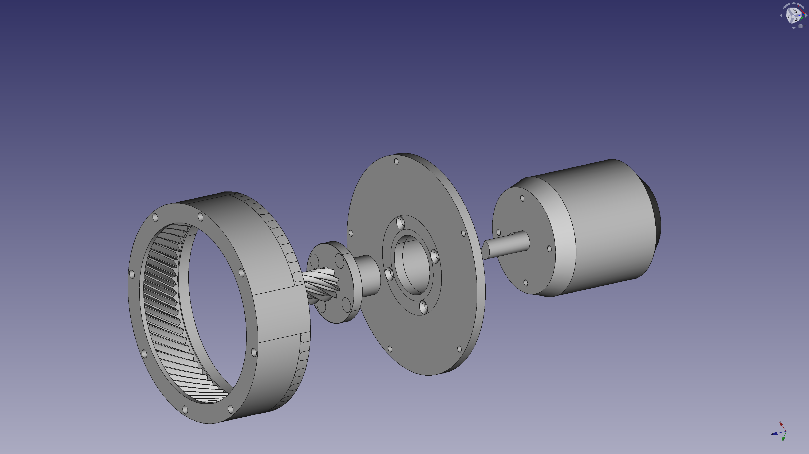

# OpenTorque Actuator 6368 Edition
### A powerful, compliant actuator for whatever ;)

This is a modification of the [OpenTorque Actuator](https://github.com/G-Levine/OpenTorque-Actuator) to be used with 6368 motors for electric skateboards. These motors are cheap and readily available.

# Project Status

Currently the model is incomplete pending receiving actual parts and test fitting.

## TODO

- [ ] Complete stand/legs for ring gear. Possibly fits on some bits of 2020?
- [ ] Print all the parts in PLA
- [ ] Receive BLDC motor
- [ ] Receive ODrive
- [ ] Receive Rest of parts (screws, inserts, etc)
- [ ] Verify Fit
- [ ] Repeat
- [ ] Profit

# Original Design

